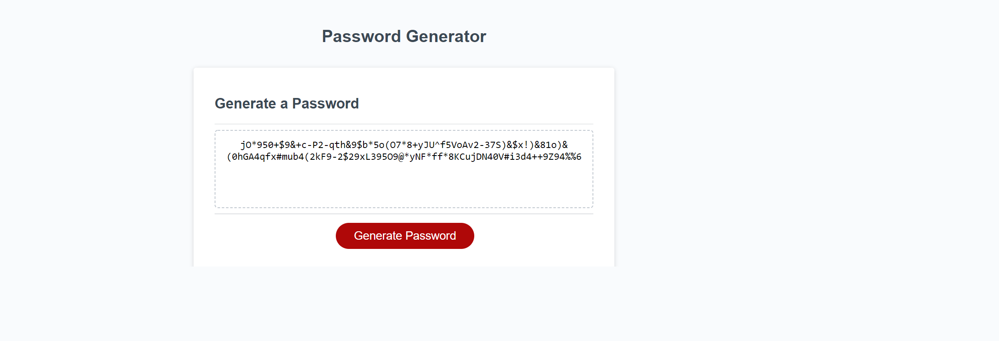

# Password Generator Web Application

## What does it do:
* Generates a random password between 8 and 128 characters;
* User can choose what type of characters to use (lowercase, uppercase, symbols and numbers);
* Prints out the generated password in the designated space;

## Links:
* Live page: https://vitokwolf.github.io/PassGeneratorVL/
* GitHub repo: https://github.com/vitokwolf/PassGeneratorVL

